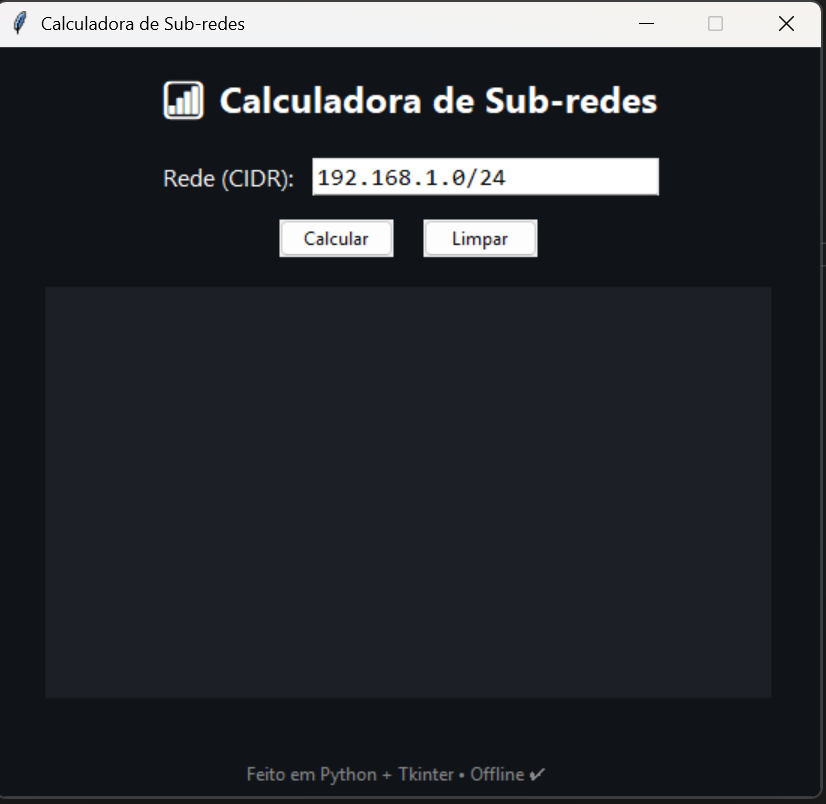

# 💻 Calculadora de Sub-redes (Python + Tkinter)

Uma aplicação gráfica moderna desenvolvida em **Python** e **Tkinter** que calcula informações de sub-redes IPv4 — ideal para estudantes, técnicos de redes e curiosos que queiram aprender subnetting de forma prática e visual.

---

## 📸 Pré-visualização

  
> Interface moderna em modo escuro com botões azuis, resultados detalhados e funcionamento offline.

---

## 🧠 Funcionalidades

✅ Cálculo completo de sub-redes IPv4  
✅ Interface moderna com tema escuro  
✅ Mostra:
- Endereço de rede  
- Máscara de sub-rede  
- Wildcard (para ACLs)  
- Endereço de broadcast  
- Número total de hosts  
- Primeiro e último host  
- Prefixo CIDR  
- Indicação se é rede privada  

✅ Botão **Limpar** para reiniciar o cálculo  
✅ Funciona **offline**, sem dependências externas  
✅ Compatível com Windows, macOS e Linux  

---

## ⚙️ Requisitos

- Python **3.8 ou superior**  
- Módulo padrão `tkinter` (já incluído com o Python)  

Verifica se o Tkinter está instalado:
```bash
python -m tkinter
